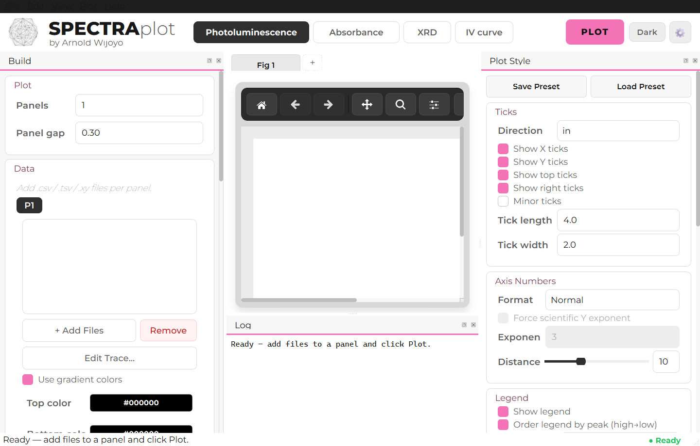
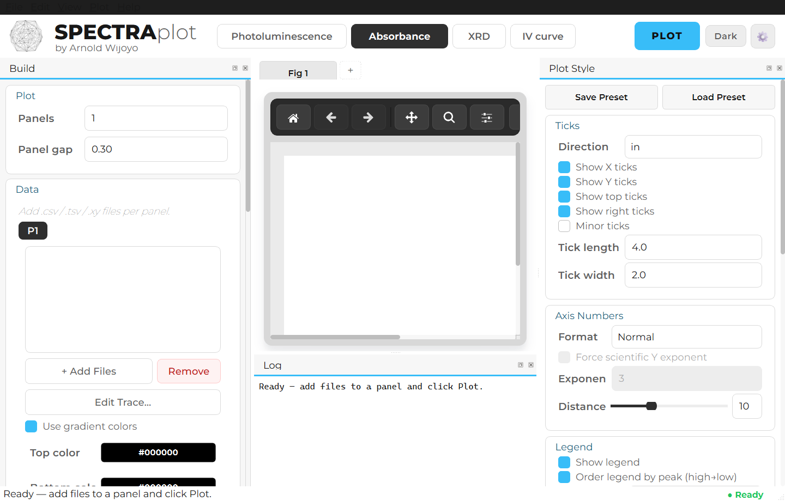
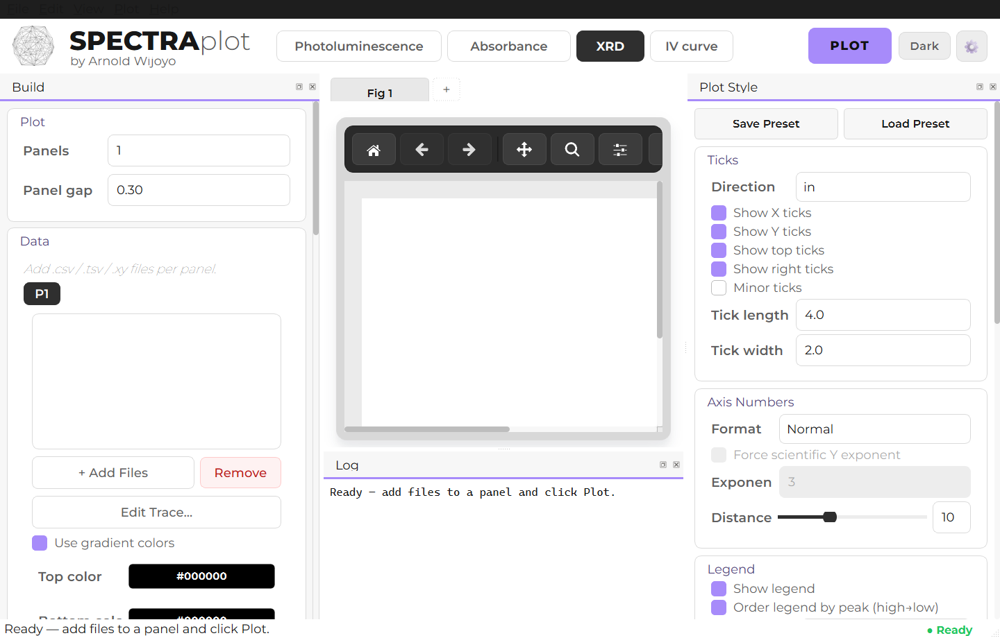
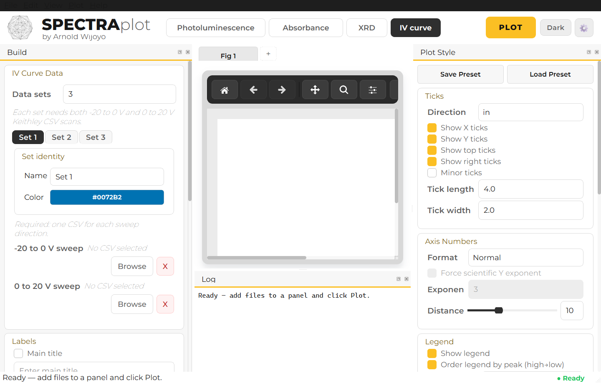

# SPECTRAplot

A cross-platform desktop application for spectrometry data visualization. Load raw measurement files, customize every visual detail, and export publication-ready figures — without touching a script.

Built with Python, PyQt6, and Matplotlib.

---

## Modes

| Mode | Description |
|------|-------------|
| **Photoluminescence (PL)** | Multi-panel PL spectra with optional baseline subtraction and gradient coloring |
| **Absorbance** | UV-Vis absorbance spectra with the same multi-panel layout |
| **XRD** | X-ray diffraction patterns; optional 2θ → d-spacing conversion, reference overlays, right-margin trace labels |
| **IV Curve** | Keithley IV sweeps; auto-stitches the −20 to 0 V and 0 to 20 V CSVs per device and auto-scales current units (A → mA → µA → nA → pA) |

---

## Features

### Data loading
- Reads `.csv`, `.tsv`, and `.xy` spectroscopy files
- Handles any number of header rows, tab/semicolon/space delimiters, and European decimal commas
- Keithley IV CSV format: columns 3 & 4 for voltage and current
- File-level caching (mtime + size signature) so unchanged files are never re-parsed

### Multi-panel layout
- Up to **5 simultaneous panels** per figure, configurable gap
- Per-panel or shared X and Y limits
- Auto-fit X/Y or manual entry

### Trace customization
- Per-trace display name, color, line width override, line style (solid / dashed / dotted / dash-dot), and visibility toggle
- Panel-level gradient coloring with configurable top/bottom colors
- Double-click any trace row to open the trace editor dialog

### Interactive figure editing
- **Drag** titles, axis labels, subtitles, and the legend to reposition them
- **Double-click** any text artist to edit content, font size, color, bold/italic
- **Double-click** the legend to edit its frame (edge color/width, fill, opacity)
- Full **Undo/Redo** for drag operations (Ctrl+Z / Ctrl+Y)
- Snap-to-grid with configurable step size

### Plot styling
- Line width and font size controls
- Figure font family (Arial, Helvetica, Times New Roman, DejaVu Sans/Serif, Liberation Sans)
- Canvas size in pixels (width × height), applied at both screen and export time
- Axis box color and line width
- Tick direction (in / out / inout), show/hide X/Y/top/right ticks, minor ticks, tick length and width
- Y-axis number format: normal, scientific notation, or engineering (K/M)
- Legend: position, font size, background color + opacity, edge color + width — all independently transparent
- PL: peak-order legend sorting (high → low peak wavelength)
- XRD: per-panel reference traces (plotted in black over all panels), right-margin trace labels with adjustable gap
- Manual subplot layout (left, bottom, width, height, gap) with snap

### Preset system
All style settings (line width, font, ticks, legend, box, XRD options, etc.) can be **saved to a JSON file** and **loaded back** — data paths are never included in presets so they are portable across machines.

### Multiple figures
The figure tab bar supports multiple independent figures in one session. Add a new figure with the `+` button; close any figure when there is more than one open.

### Export
- PNG, PDF, and SVG at configurable DPI (72–600)
- Export size matches the canvas size spinboxes exactly
- Matplotlib fonts embedded as Type 42 (PostScript/PDF-safe)

### Dark mode
One-click toggle in the header switches the entire UI and the canvas background between light and dark themes.

### Status bar & logging
- Live cursor coordinate readout (wavelength/intensity or 2θ/intensity)
- Ready indicator and plot status label
- Detachable **Log dock** showing internal plot events

---

## Screenshots

| Photoluminescence | Absorbance |
|-------------------|------------|
|  |  |

| XRD | IV curve |
|-----|----------|
|  |  |

---

## Requirements

- Python 3.10+
- PyQt6 ≥ 6.4.0
- matplotlib ≥ 3.6.0
- numpy ≥ 1.23.0

---

## Installation

```bash
# Clone the repository
git clone <repo-url>
cd portfolio

# Install dependencies
pip install -r requirements_spectra.txt
```

---

## Running

```bash
python spectra_app.py
```

If a required package is missing, the app prints the exact install command and exits cleanly.

---

## Project structure

```
spectra_app.py          — main application (UI, plotting, file I/O)
spectra_theme.py        — palette, stylesheet, and shadow helpers
requirements_spectra.txt
assets/
  logo.png              — header logo (optional; app starts without it)
  loading.png           — loading screen artwork
  screenshots/          — README screenshots generated from the current UI
tests/
  test_loading_screen.py
  test_spectra_aux_docks.py
  test_spectra_plotting_behavior.py
  test_spectra_static_regressions.py
  test_spectra_theme_module.py
  test_spectra_ui_layout.py
  test_spectra_window_chrome.py
```

---

## Running tests

```bash
python -m unittest discover -s tests
```

The test suite covers UI layout, window chrome, plotting behavior, the theme module, auxiliary docks, the loading screen, and static regressions.

---

## File formats

### Spectroscopy files (PL / Absorbance / XRD)

Two-column plain text. Any of these are accepted:

```
# optional header lines
400.0   0.012
400.5   0.018
```

- Delimiter: tab, semicolon, comma, or whitespace
- European decimals (commas) supported when the primary delimiter is tab or semicolon
- Header lines starting with `#`, `%`, or `!` are skipped automatically

### IV CSV (Keithley format)

Column 3 = voltage (V), column 4 = current (A). Rows with fewer than 4 numeric columns are skipped.

---

## Design

SPECTRAplot follows a "monochrome instrument" design philosophy: white plotting surface, neutral gray chrome, and upright technical typography. The three mode colors (PL pink `#F472B6`, Absorbance blue `#38BDF8`, XRD violet `#A78BFA`) are reserved for plotted data only and never appear in UI chrome.

See [DESIGN.md](DESIGN.md) for the full design system and [PRODUCT.md](PRODUCT.md) for the product brief.

---

## Author

Arnold Wijoyo
